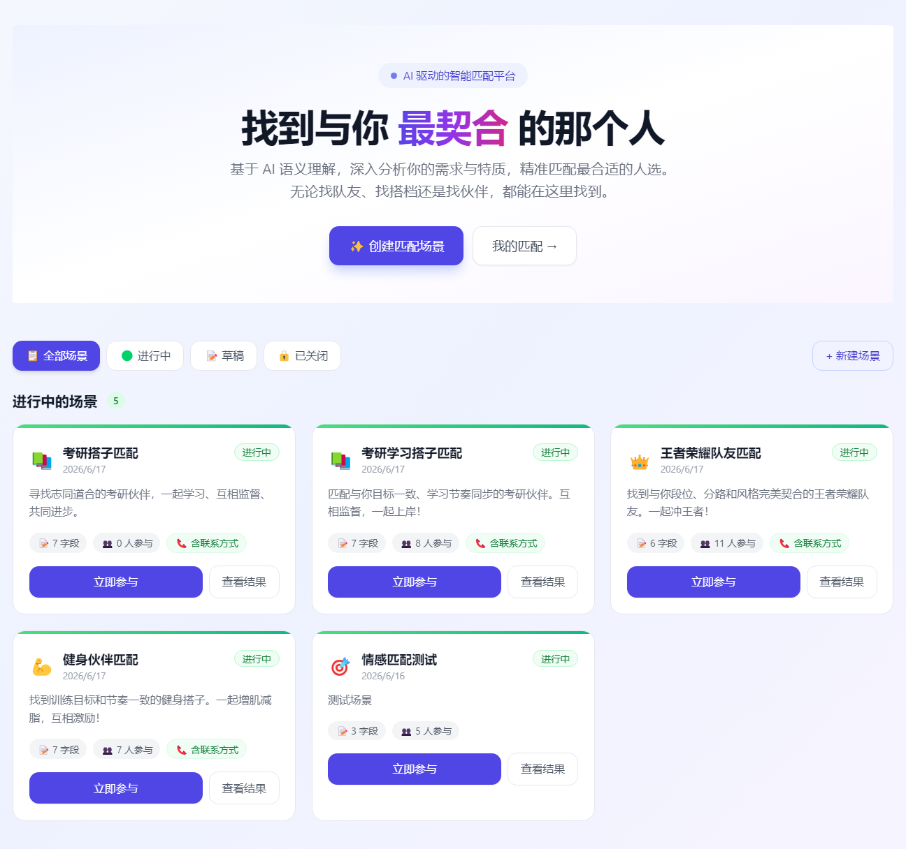
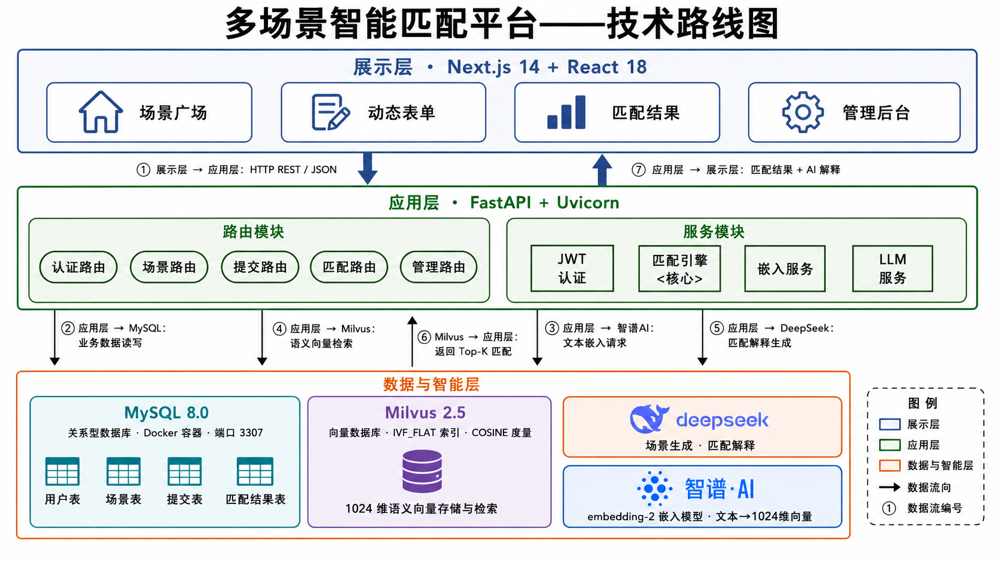
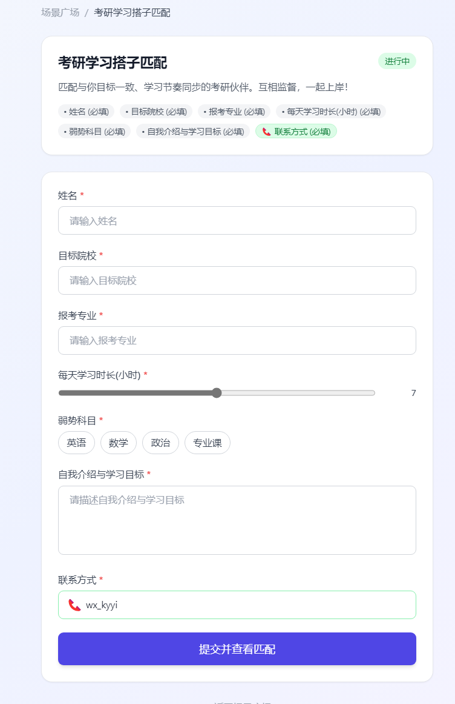
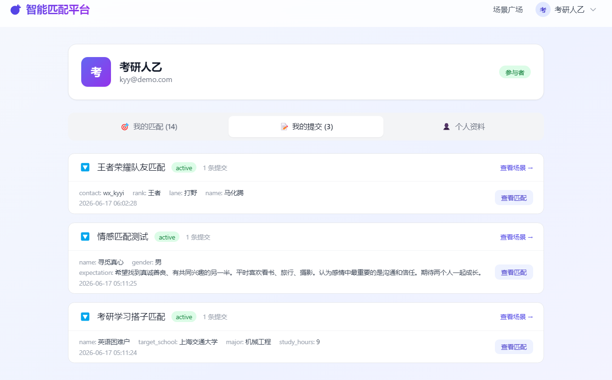
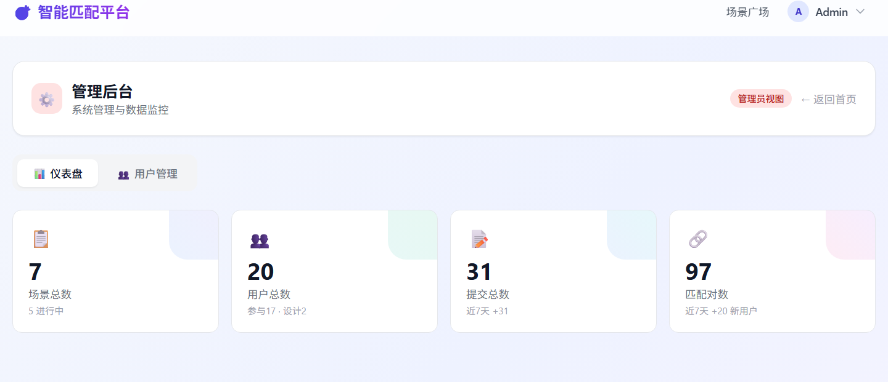
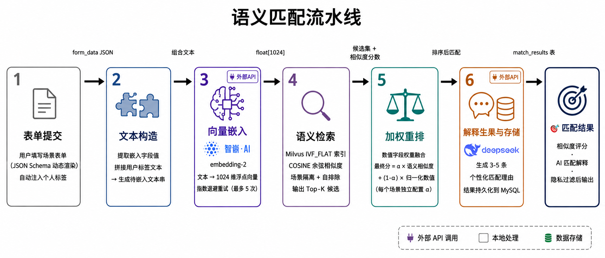
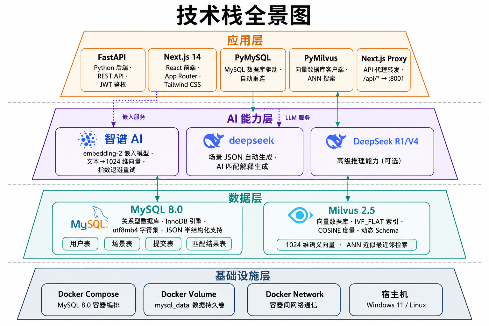

# 🎯 Match Everything — 多场景智能匹配平台

基于 **AI 语义匹配**的全栈匹配平台。创建自定义匹配场景，填写个性化表单，AI 自动寻找最佳匹配对象并生成解释。

> 适用于游戏队友、学习搭子、健身伙伴、摄影约拍等任意匹配场景。

<p align="center">
  
</p>

## ✨ 核心特性

- **🎨 动态场景系统** — 9 种表单字段类型，JSON Schema 驱动渲染，无需写代码即可创建任意匹配场景
- **🤖 AI 生成场景** — 用自然语言描述需求，DeepSeek 自动生成完整场景配置（表单 + 匹配规则 + UI）
- **🧠 语义向量匹配** — 智谱 AI embedding-2（1024 维）+ Milvus 向量数据库 COSINE ANN 搜索，突破关键词匹配局限
- **📊 混合数据库架构** — MySQL 8.0（业务数据）+ Milvus 2.5（语义向量），各司其职
- **🔒 隐私保护** — 双层防护：低分匹配隐藏 + 联系方式智能遮蔽
- **🛡️ 三级权限** — participant / designer / admin，基于角色的访问控制（RBAC）
- **🐳 容器化部署** — Docker Compose 一键启动 MySQL，健康检查 + 自动恢复

## 🏗️ 系统架构

<p align="center">
  
</p>

```
展示层 (Next.js 14 + React 18, Port 3000)
       ↕ REST / JSON
应用层 (FastAPI + Uvicorn, Port 8001)
       ↕ PyMySQL / PyMilvus / HTTPS
数据层 (MySQL 8.0 + Milvus 2.5 + AI APIs)
```

| 层 | 技术栈 | 职责 |
|---|--------|------|
| 展示层 | Next.js 14, React 18, Tailwind CSS, TypeScript | 动态表单渲染、匹配结果可视化 |
| 应用层 | FastAPI, Uvicorn, PyMySQL, PyMilvus | RESTful API、JWT 认证、匹配编排 |
| 数据层 | MySQL 8.0 (Docker), Milvus 2.5, 智谱AI, DeepSeek | 业务存储、向量检索、嵌入生成、LLM 解释 |

## 🚀 快速开始

### 前置要求

- **Docker Desktop**（运行 MySQL 8.0 容器）
- **Python 3.10+**（后端）
- **Node.js 18+**（前端）
- 智谱 AI API Key + DeepSeek API Key

### 1. 配置环境

```bash
cd backend
cp .env.example .env
# 编辑 .env，填入你的 API Key
```

```ini
# backend/.env
DEEPSEEK_API_KEY=sk-xxxxxxxx
ZHIPUAI_API_KEY=xxxxxxxxxxxxxxxx
MYSQL_HOST=localhost
MYSQL_PORT=3307
MYSQL_USER=matching_user
MYSQL_PASSWORD=matching_pass_2026
MYSQL_DATABASE=matching_platform
```

### 2. 安装依赖

```bash
# 后端
cd backend
pip install -r requirements.txt

# 前端
cd frontend
npm install
```

### 3. 启动服务

**方式一：一键启动（Windows）**

双击 `start.bat`，自动检测 Python、启动 Docker MySQL、轮询就绪状态、依次启动后端和前端。

**方式二：手动启动**

```bash
# 终端 1：启动 MySQL 容器
docker compose up -d

# 终端 2：启动后端 (Port 8001)
cd backend
python run.py

# 终端 3：启动前端 (Port 3000)
cd frontend
npm run dev
```

### 4. 导入演示数据

```bash
cd backend
python ../scripts/seed_demo_data.py
```

### 5. 访问系统

| 服务 | 地址 |
|------|------|
| 🏠 前端首页 | http://localhost:3000 |
| 📡 API 文档 | http://localhost:8001/docs |
| ❤️ 健康检查 | http://localhost:8001/api/health |

### 演示账号

| 角色 | 邮箱 | 密码 |
|------|------|------|
| 管理员 | admin@qm.com | admin123 |
| 设计师 | dsn@demo.com | demo123456 |
| 普通用户 | xm@demo.com | demo123456 |

## 🎮 功能演示

### 场景广场

浏览所有活跃的匹配场景，一键进入填写表单。

<p align="center">
  
</p>

### 动态表单

基于场景的 JSON Schema 自动渲染表单，支持 text、textarea、number、select、multi_select、slider、date、tag_input、contact 共 9 种字段类型。

<p align="center">
  
</p>

### AI 匹配结果

提交表单后自动触发匹配流水线：嵌入生成 → 向量搜索 → 加权重排 → AI 解释。匹配结果卡片展示相似度分数、匹配对象信息和 DeepSeek 生成的个性化解释。

<p align="center">
  
</p>

### 管理后台

全局数据统计、用户角色管理、场景管理。密码哈希已脱敏。

<p align="center">
  
</p>

## 🧩 AI 匹配流水线

```
表单提交 → 文本构造 → 向量嵌入 → 语义检索 → 加权重排 → 解释生成 → 结果存储
   │           │          │           │           │           │          │
   │    注入用户标签  智谱AI       Milvus     数值字段     DeepSeek   MySQL
   │               embedding-2   IVF_FLAT   权重融合      LLM     双写
   │               1024-dim      COSINE
```
<p align="center">
  
</p>

1. **文本构造** — 提取场景配置的嵌入字段，拼接用户个人标签
2. **向量嵌入** — 智谱 AI embedding-2 将文本转为 1024 维向量（指数退避重试）
3. **语义检索** — Milvus COSINE ANN 搜索，场景隔离 + 自排除
4. **加权重排** — 数值字段（如胜率、学习时长）权重融合：`score = α·cosine + (1-α)·norm`
5. **解释生成** — DeepSeek 生成 3-5 条个性化匹配理由
6. **结果存储** — MySQL match_results 表持久化 + 隐私过滤

## 📡 API 端点

系统提供 **22 个 RESTful API 端点**，通过 FastAPI 自动生成 Swagger 文档（`/docs`）。

| 模块 | 端点 | 说明 |
|------|------|------|
| Auth | `POST /api/auth/register` | 用户注册 |
| Auth | `POST /api/auth/login` | 用户登录 |
| Auth | `GET/PUT /api/auth/me` | 查看/编辑个人信息 |
| Scenarios | `GET /api/scenarios` | 场景列表 |
| Scenarios | `POST /api/scenarios/generate` | AI 生成场景 |
| Submissions | `POST /api/submissions` | 提交表单 |
| Matching | `POST /api/matching/run/{id}` | 运行匹配 |
| Matching | `GET /api/matching/results/{id}` | 查询匹配结果 |
| Admin | `GET /api/admin/stats` | 全局统计 |
| Admin | `GET /api/admin/users` | 用户管理 |

## 🗄️ 数据库设计

### MySQL（关系型）

| 表 | 说明 | 核心字段 |
|----|------|---------|
| `users` | 用户 | id, email (UNIQUE), password_hash (bcrypt), role, contact_info, tags (JSON) |
| `scenarios` | 场景 | id, creator_id, form_schema (JSON), match_config (JSON), ui_config (JSON), status |
| `submissions` | 提交 | id, scenario_id (FK), user_id (FK), form_data (JSON), embedding_vector |
| `match_results` | 匹配结果 | id, submission_id (FK), matched_submission_id (FK), similarity_score, explanation |

### Milvus（向量）

| 集合 | 说明 | 配置 |
|------|------|------|
| `matching_vectors` | 语义向量存储 | 1024-dim FLOAT_VECTOR, IVF_FLAT 索引, COSINE 度量, 动态 Schema |

## 📁 项目结构

```
matching-platform/
├── start.bat                      # 一键启动脚本
├── docker-compose.yml             # MySQL 8.0 容器
├── backend/
│   ├── .env.example               # 环境变量模板
│   ├── requirements.txt
│   ├── run.py                     # Uvicorn 入口
│   └── app/
│       ├── main.py                # FastAPI 应用
│       ├── config.py              # 配置管理
│       ├── database/mysql.py      # MySQL CRUD (577行)
│       ├── models/scenario.py     # Pydantic 模型
│       ├── routers/               # 5 个路由模块
│       └── services/              # 5 个服务模块
├── frontend/
│   ├── package.json
│   └── src/
│       ├── lib/api.ts             # HTTP 客户端 + 自动重试
│       ├── lib/auth.tsx           # React 认证上下文
│       ├── app/                   # 页面路由
│       └── components/            # UI 组件
└── scripts/
    ├── seed_demo_data.py          # 演示数据
    └── seed_more_data.py          # 扩展数据
```

## 🔧 技术栈

| 组件 | 选型 | 理由 |
|------|------|------|
| 业务数据库 | **MySQL 8.0** (Docker) | ACID 事务、JSON 支持、utf8mb4 |
| 向量数据库 | **Milvus 2.5** | IVF_FLAT、COSINE、动态字段 |
| 后端框架 | **FastAPI** | 异步、自动文档、依赖注入 |
| 前端框架 | **Next.js 14** | App Router、SSR、API 代理 |
| 嵌入模型 | **智谱 AI embedding-2** | 1024-dim, 中英文优化 |
| 对话模型 | **DeepSeek** | 场景生成 + 匹配解释 |
| 认证 | **JWT (HS256)** + bcrypt | access 24h / refresh 7d |
| 容器化 | **Docker Compose** | 一键部署、健康检查、数据持久化 |
<p align="center">
  
</p>

## 📄 License

MIT
